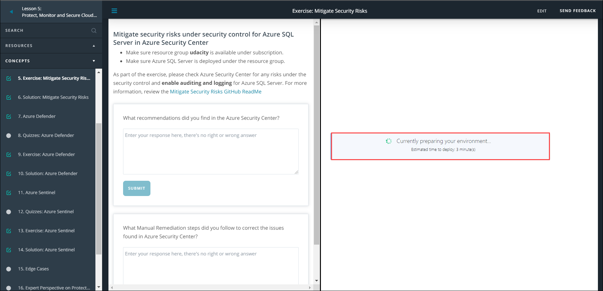
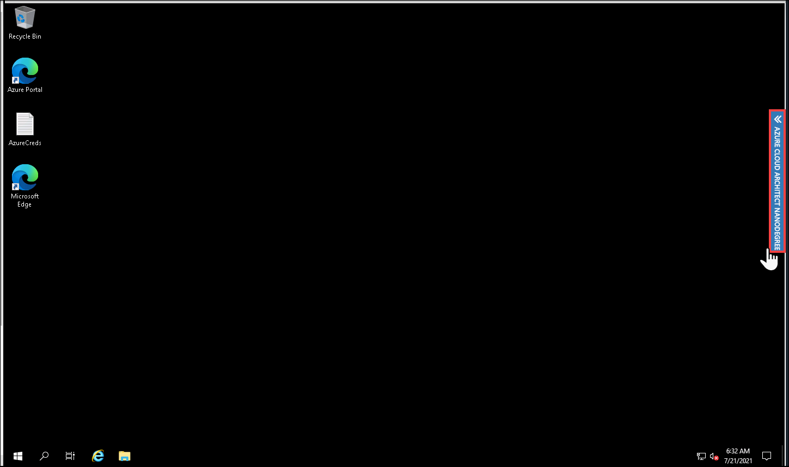
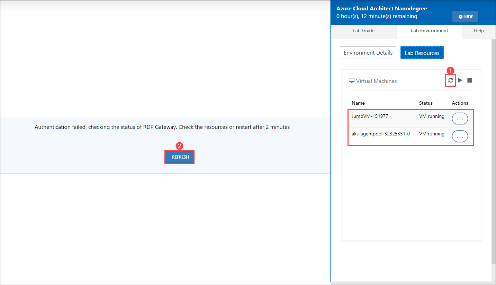

# CloudLabs Features

## Getting Started

1. On the Lab page, you will have the lab environment on the right side. To access the Lab environment select **ACCESS LAB**.

2. The lab environment will start preparing and it will show you the estimated time of your deployment.

3. You can hide the left navigation pane by clicking on **collapsed menu icon**(the one with three horizontal bars).

4. Once the lab environment is ready, you will have a host virtual machine which you will be using throughout to perform the lab.

5. You have a slide button on the right side of the screen, select it to view the lab guide.

6. Here you have three tabs - **Lab Guide, Lab Environment** and **Help**. The **Lab Guide** tab has instructions in it that should be followed in order to successfully complete the lab.

7. Next you have **Lab Environment** tab in which you have **Environment Details** section, where you can find details such as _Login credentials for your User_, _VM login credentials_.

8. In **Lab Environment** tab, you have another section that is **Lab Resources**. In this section, you will have the following items:
* All those virtual machines listed which are present in your lab environment
* Status of the VM as if it's running or deallocated.
* Three action buttons: 
      
     * **(1) Refresh:** Select this button to refresh the page and see the latest status of the Virtual Machines.
      
     * **(2) Start:** Select this button to start all the Virtual Machines at the same time.
      
     * **(3) Stop:** Select this button to de-allocate all the Virtual Machines at the same time.

9. In case you want to perform an action on a specific Virtual Machine, then from **Actions** select the **ellipses(...)** given against your desired Virtual Machine. As your options, you will have **Start, Stop and Restart**, so you can select the required action.

10. At last, you have **Help** tab where we have listed known issues such as Unable to copy paste, Need credentials and much more. In case if you face any of these issues, you can troubleshoot it by following the insturctions given this section.

11. You can also hide the Lab guide by selecting **Hide** button from top-right corner of the lab guide. 

12. It will take you back to the very first interface where you had the host virtual machine. 

## Features

1. Enable Attendee Tracking

2. Enable Hot Instances 

3. Allow User to Extend lab

### **1. Enable Attendee Tracking**

**Enable Attendee Tracking** feature helps to track user's activity in their lab environment and perform certain actions termed as **Time Out Operation**. The operations are listed below:

* **Resource Stop -** Virtual machines will be stopped.
* **Delete Environment -** Lab environment will be deleted.

In case a user is inactive in the lab environment for a particular span of time, then as per the configurations of the enviornment, one of the above mentioned operation will be imposed on that user's environment. The time period of inactivity by a user is termed as **Environment Idle Timeout** that will configured in minutes.

From here we will learn more about the feature with the help of an example. 

1. Let's say we have a user **User01** and he has:
* **Environment Idle Timeout** set to **10 minutes** 
* **Time Out Operation** set to **Resource Stop**

2. User01 is performing the lab, then he takes a break which means his environment will be idle till he starts again. So as per the **Environment Idle Timeout**, once he reaches to the inacitvity time limit(i.e., 10 minutes), all the resources of his environment will stop of as **Time out operation** was set to **Resource Stop**.

3. Once User01 is back, he will have a note similar to the image shown below. It will say that **RDP Gateway is not running** which means your host VM is in stopped state.

4. Now to continue the lab, User01 should start his VM again by navigating to **Lan Environment** tab **> Lab Resources.** You can see all the VMs are in deallocated state. So, select the **Start** button to start them all.

5. Select **OK** on the popup asking you to confirm - **Start All Virtual Machines**.

6. Once the process starts, you will get a heads-up in the bottom-right corner of the guide saying **Successfully initiated the virtual machine operation**.

7. Select **Refresh** button to view the updated status of the VMs. Once the VMs are back into running state, User01 will select **Refresh** button on the screen and the host VM will launch for him.

**2. Enable Hot Instances:** Hot instance is basically a lab environment which is deployed and made available sometime before a workshop begins.

 * For an actual workshop, we deploy hot instances depending on the projected user count. Those many instances will be made available 30 minutes before the Workshop Start Time.

* Next, when a user will register, the hot instance(i.e., the pre-deployed lab environment) will get allocated to instantly which results in **Zero wait time for users**. As soon they launch the lab, they will get the lab environment.

* This feature reduces risk or any kind of deployment issues. In case there's an issue, it can be fixed in advance as they are deployed earlier from the Workshop time.

* **Optimize Hot Instances VM Cost:** This feature works in a way where as soon as hot instances are ready, it shutdowns the resources to optimize the cost. A **Delay time** is provided here, say 5 minutes. So once the hot instances are ready, it will wait for 5 minutes and then stop the resources.

* **Limit Hot Instance Life:** In this feature, a duration is setup to delete the hot instances. Once the duration is exhausted, hot instance will delete. This feature is used to avoid having unused hot instances.

Let's say, for a workshop we have user count less than expected, so we will end up with unused hot instances. In this case, this feature will act according to the duration setup in it, such as we setup 60 minutes. Therefore, if a hot instance is not allocated to a user till 60 minutes, it will automatically get deleted.

Allow User to Extend lab

if enabled u get - Max Limit of Duration Extension by User (Minutes) 

